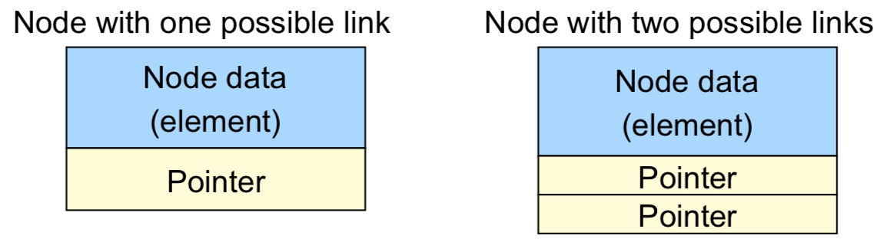
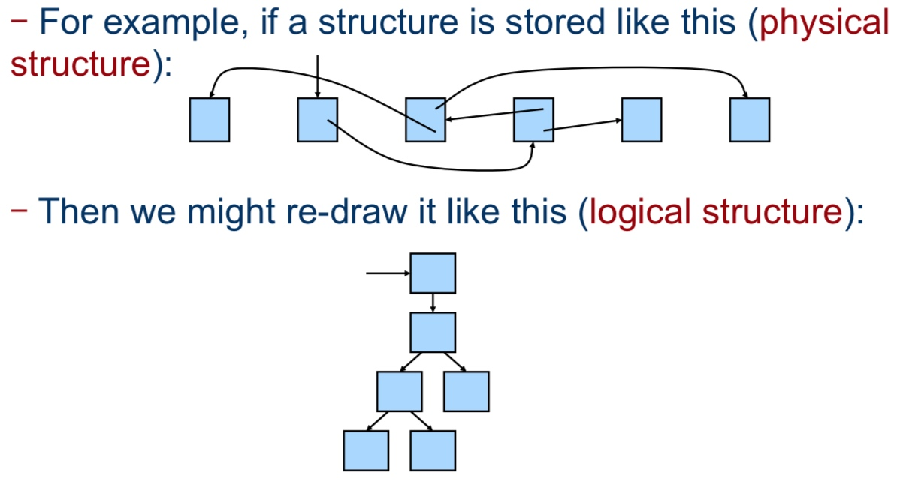
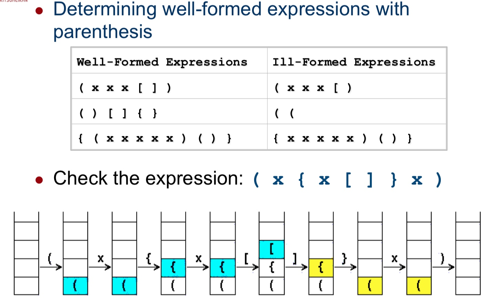
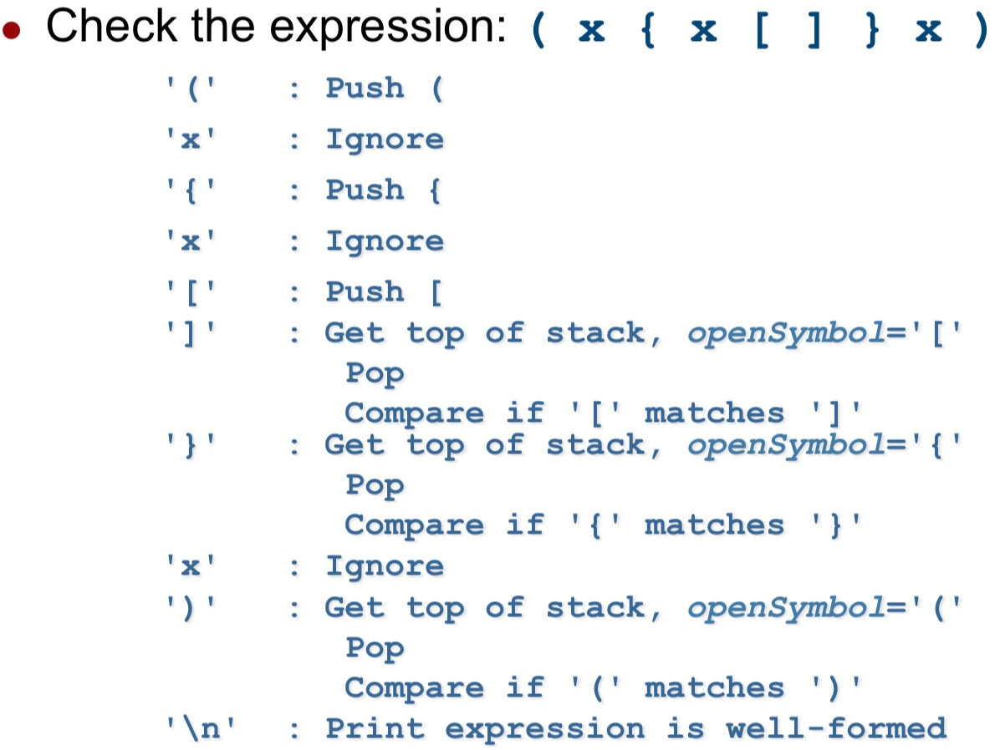
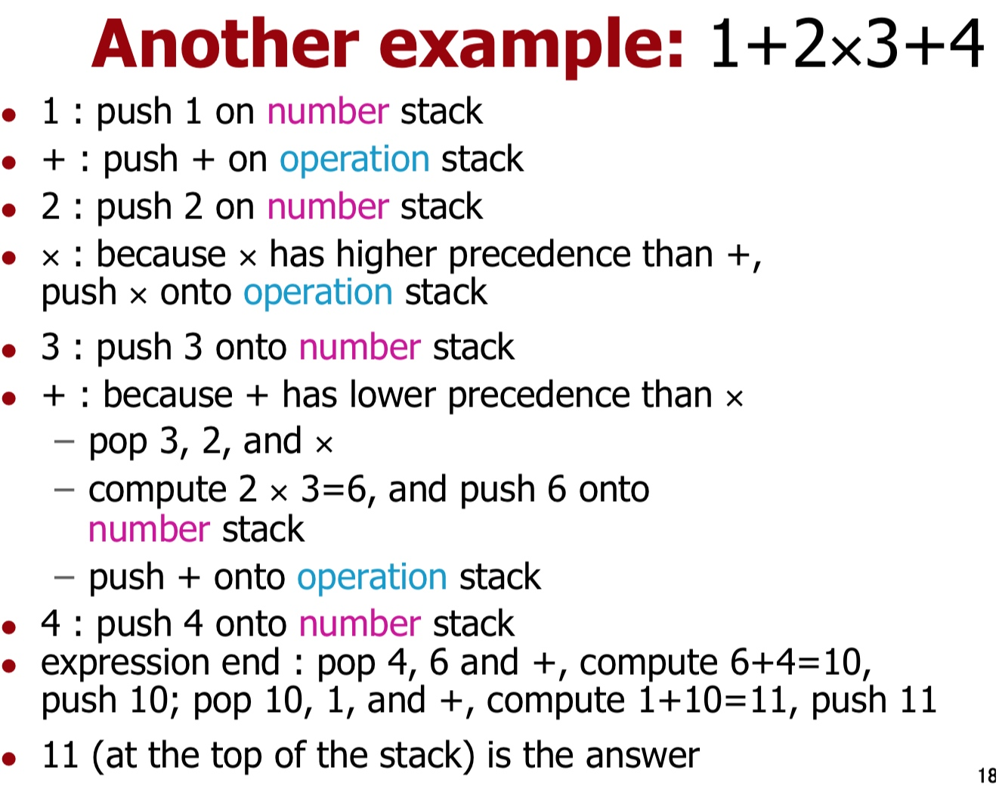

# Week 02
Topic: Basic Data Structures
Keywords: Array, Linked list (based on nodes), Stack, Queue

## Array
- Objects are stored in **contiguous memory** locations and referenced by an index.
- There is little memory-management overhead
- Look-up operations are usually **very fast**
- Operations that require rearrangement (insert, remove, etc.) **can be slow**

## Nodes

### Linked list

Linked lists:
Node --> Node --> Node (Left)
(Head: Header)(Mid: Node/Position)(End: Trailer)

Doubly linked list: 
Node <-> Node <-> Node (Right)

😀 Advantages of doubly linked lists:
(also as the disadvantages of singly linked lists)

- **Can be traversed** in either direction (may be
essential for some programs)
- Some operations, such as deleting and inserting before a node, become easier

☹️ Disadvantages of doubly linked lists:

- **Requires more space** 
- List manipulations are slower (because more links must be changed)
- Greater chance of having bugs (because more links must be manipulated)

### Physical vs. Logical

## Stacks
**FILO = First In Last Out**

### Operations
**Push** = Add new item to top
**Pop** = Remove an item from top

### Stack application example

## Queue
**FIFO = First In First Out**

### Operations
enQueue = Add new item at the rear (the end of queue)
deQueue = Remove an item from the front

