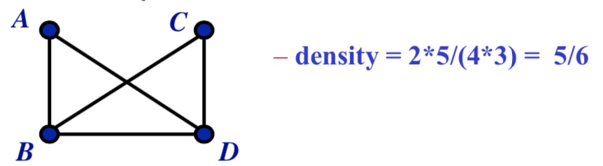
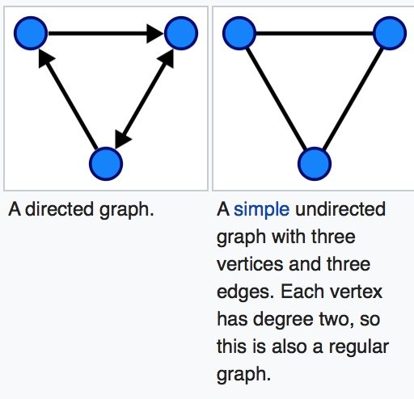
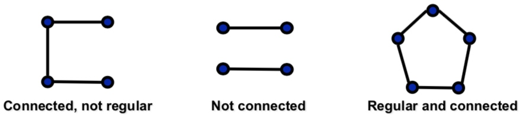
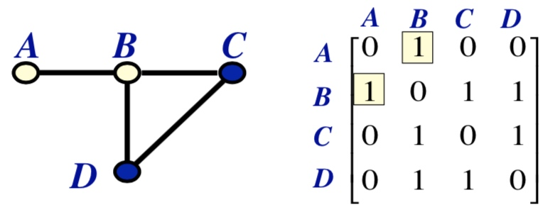
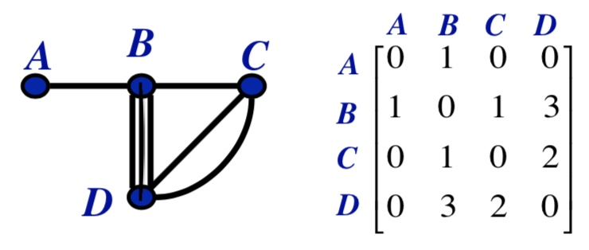
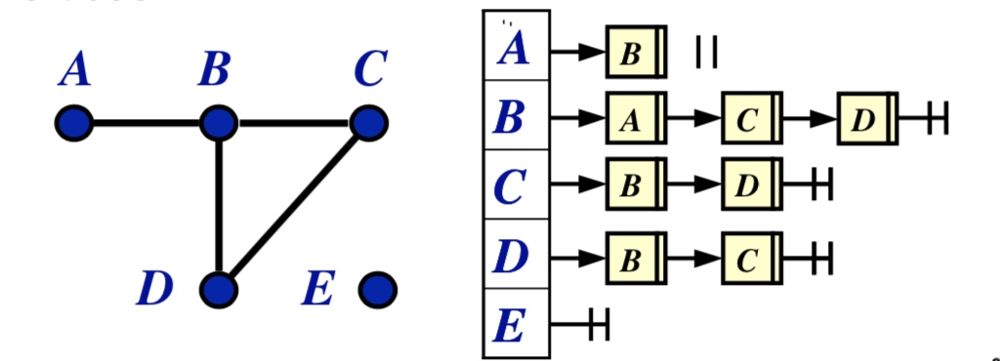
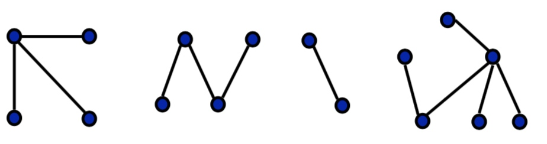
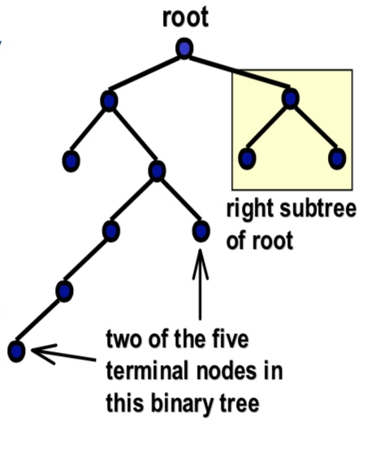
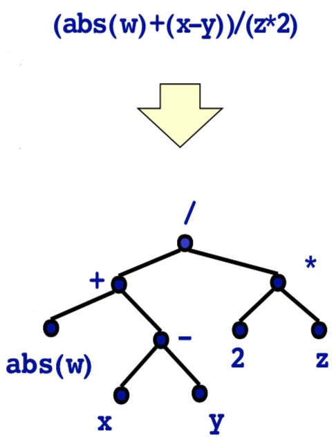

# Week 03
Applications of Basic Data Structures

## Graphs
### 名词
G = Graph 图
V = Vertices (Vertex 顶点)
E = Edges 边
arc 弧（一种带箭头的边）

边的两边是一个点 = loop（自环）

order 阶 = 顶点数
size = 边数
degree(A) A的度 = 连接到 A 点的边数

### 概念&说法
A----e----B
讨论上面这个关系的话：

- A and B are the **endpoints** of edge e.
- e **connects** A and B.
- Edge e **incident on** vertex A.
- Edge e **incident on** vertex B.
- 以上

两点之间有一条以上的边 = adjacent (邻接)

密度计算公式
$Density = \frac{2 \times size}{order \times (order - 1)}$
中文公式
$密度 = \frac{2 \times 边数}{顶点数 \times (顶点数 - 1)}$

例子：

directed graph = 有箭头的 （有 arc）
undirected graph =  没箭头的
multigraph = 有一个以上环 or 两点拥有多条边
simple graph = 无环 and 两点之间边 <= 1

📣**容易被考**
traversable graph = 可以一笔画的
non-traversable graph = 不可以一笔画的
> 规律：
a multigraph is traversable if and only if it has two or fewer vertices with odd degree numbers
即一笔画条件是：图中度为奇数的顶点数目 <= 2

trivial graph = 一个顶点，且没有边
trivial: 不重要的 

complete graph = 每个点都互相连接（两点之间必有线）
connected graph = 每个点都有一个边和其他点相连
regular graph = connected graph 的条件之上，每个点的度是一样的

## 用 Adjacency matrix 表示
中文名：邻接矩阵

操作方式：连着的话就写连线的个数，没连上就写个0。

## 用 linked lists 表示

操作方式：每个点的出口按需罗列即可。

### Tree graphs 树图

(Hamiltonian) circuit = 碰每个顶点1次然后能回到原点
tree graph = connect graph and (no circuit)

### Binary trees 及其应用

