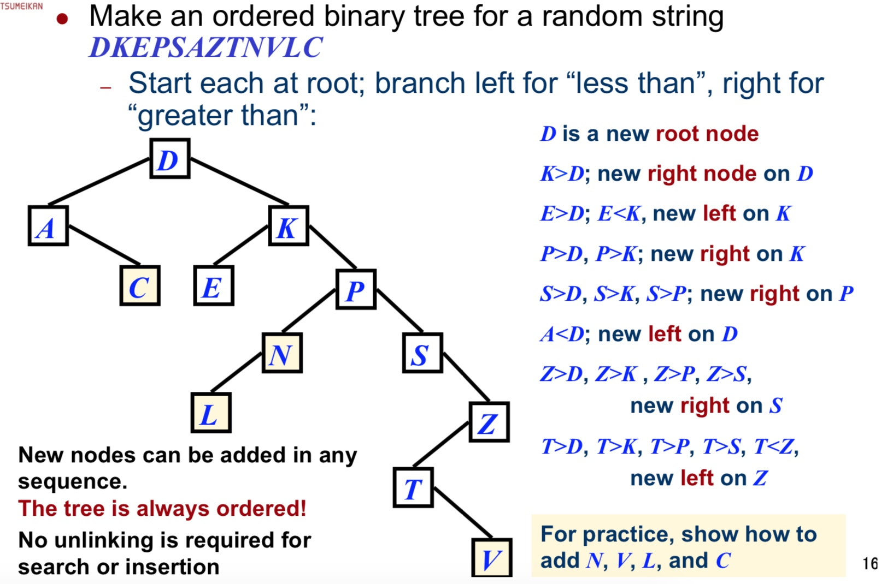

# Week 04
Basic Search Algorithms

## Linear (sequential) search 
中：线性搜索

Left | 0 | 1 | 2 | 3 | 4 | 5 | 6 | 7 | 8 | 9 | Right

从左侧进入，对比值，找到返回位置（开始于0）。
若从 Right 离开时还未找到，返回 none。

对于长度为 n 的数据来讲，最长搜索次数 n 次。
平均 $\frac{n}{2}$ 搜索次。

## Binary Search
中：二分查找

Left | 0 | 1 | 2 | 3 | 4 | 5 | 6 | 7 | 8 | 9 | Right

先进行大小排序，然后根据比较结果选择左侧区域或是右侧区域
对于长度为 n 的数据来说，最长搜索次为 $log_{2}{n}+1$ 次

## Depth and breadth
depth = 深度
breadth = 宽度

Breadth-first search (BFS)
优先宽度 = 同层内先搜索完毕，再进入下层。
行1行2行3

Depth-first search (DFS)
优先深度 = 先升入底层搜索，再回到上层寻找。
列1 列2 列3

## ordered binary trees
有序二叉树

### 生成方式

## 搜索的效率

线性搜索 = 简单且可在不排序时运行
二分查找 = 需要排序，且每次排序成本高
二叉树 = 排序和搜索并重，且效率还行

