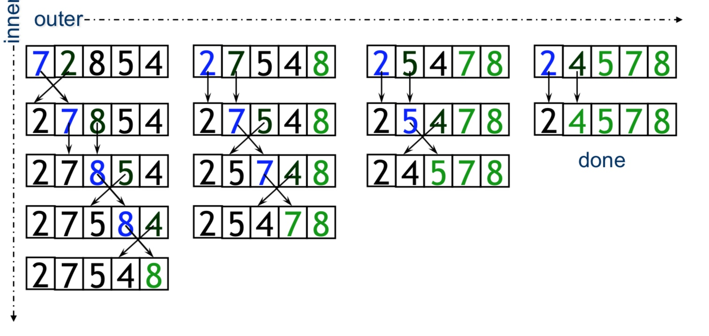
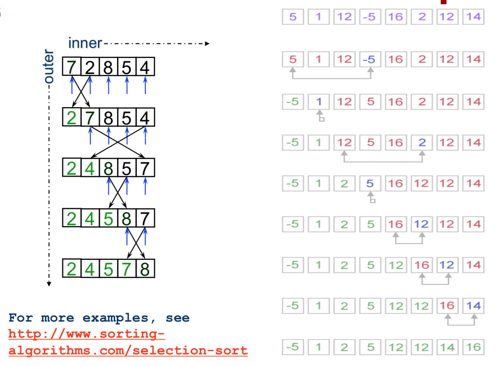
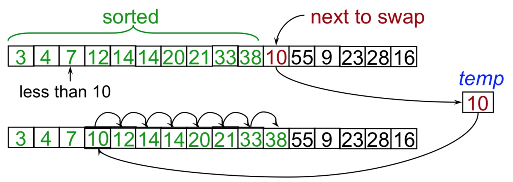
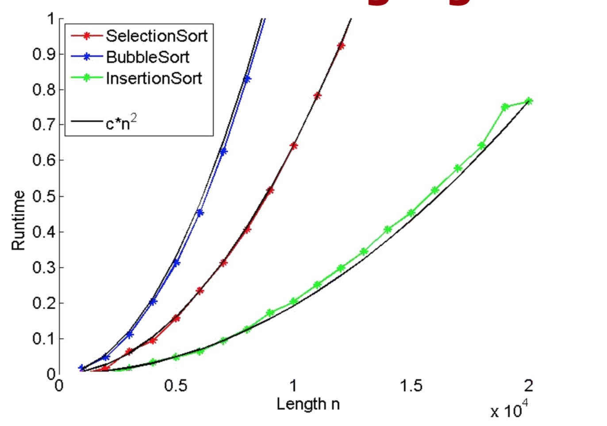

# Week 05
## Bubble sort

冒泡排序

例子之 **从小到大排序**

>外循环 = i-1 次 
>   
    内循环：（假设是确定第 j 个数字）
    从前到第 j 位两两对比，把大的放在后面
    每次能确定一个位置。
> 循环结束，排序完成

## selection sort
选择排序

操作方式：每次寻找最小的放到前面去

## insertion sort
插入排序

将待排序数据插入到已排序数据的合适位置。

## 效率对比

冒泡 < 选择 < 插入

冒泡：慢到窒息
选择：一般般，算快了
插入：挺快的

