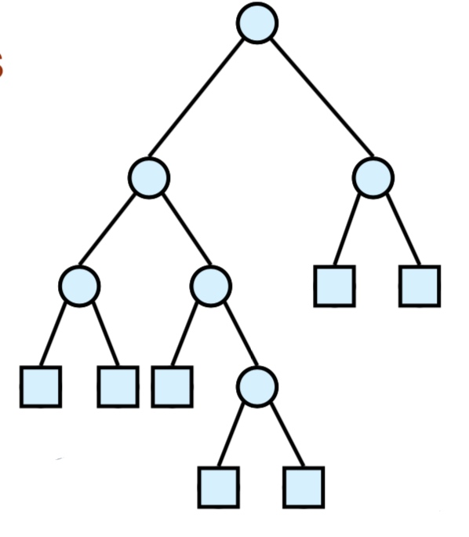
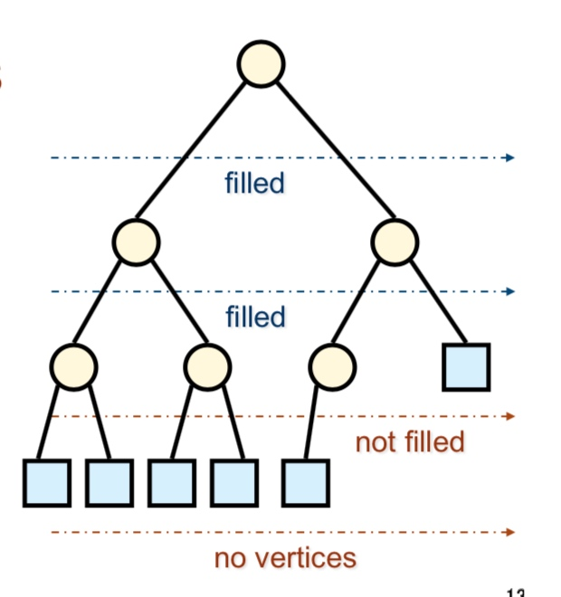
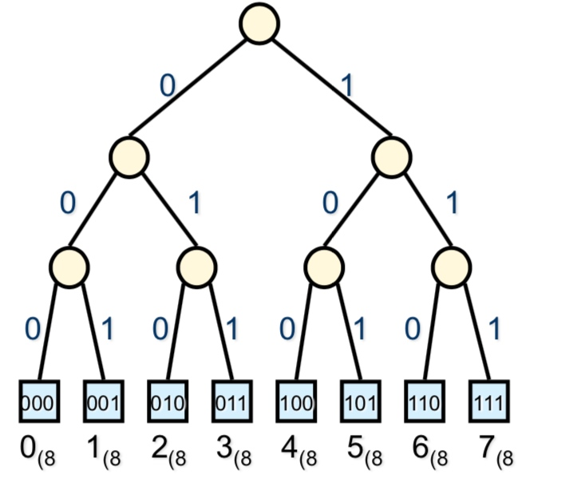
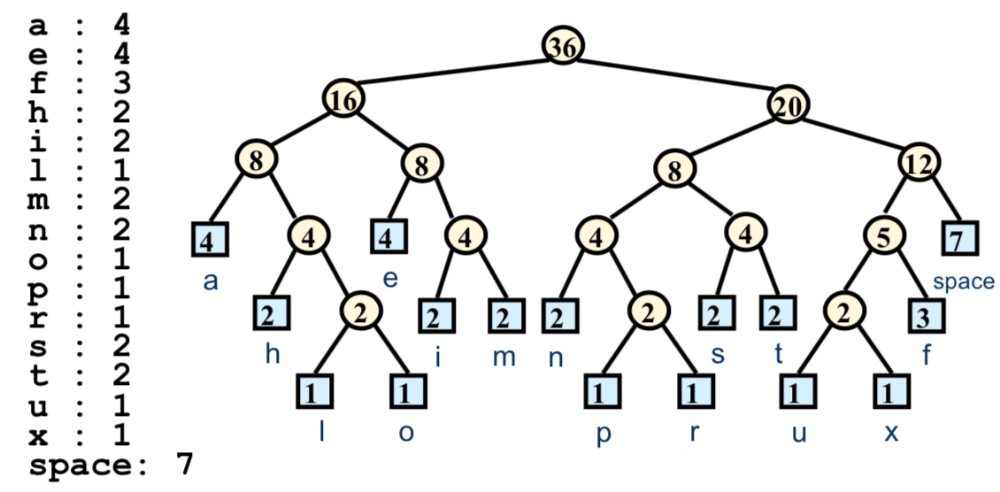
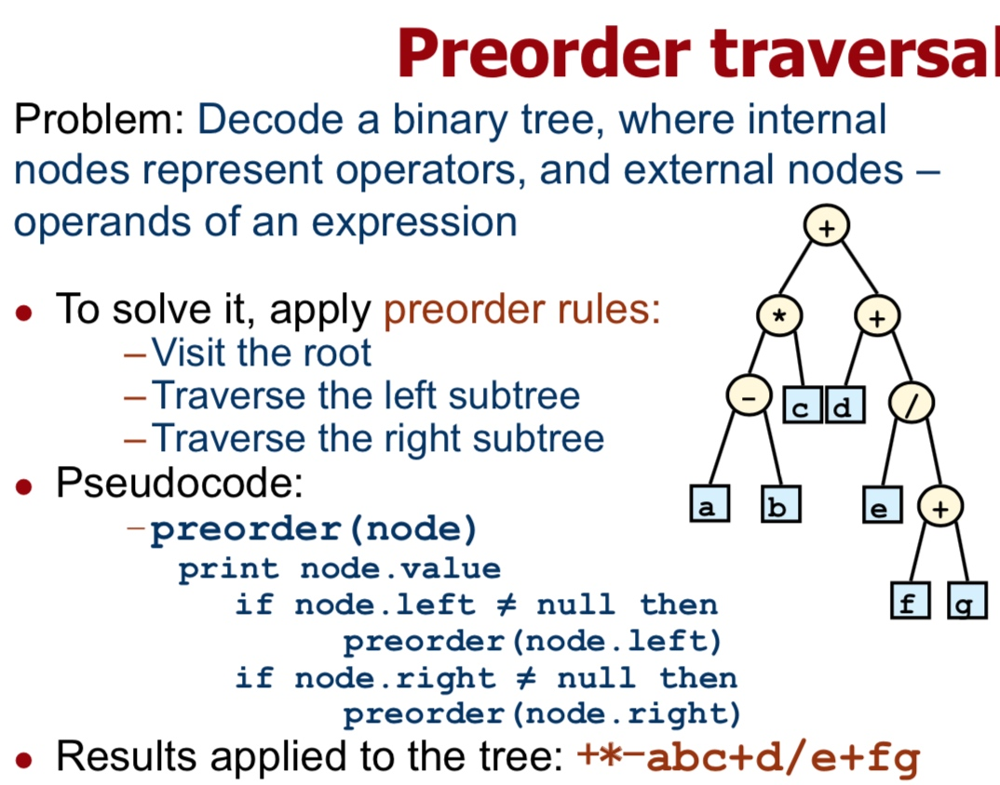
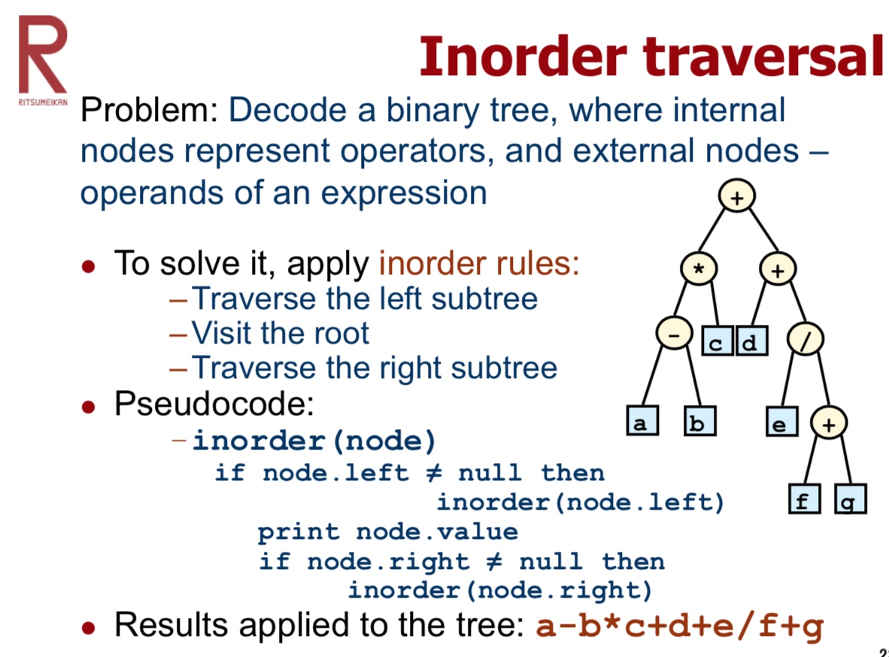
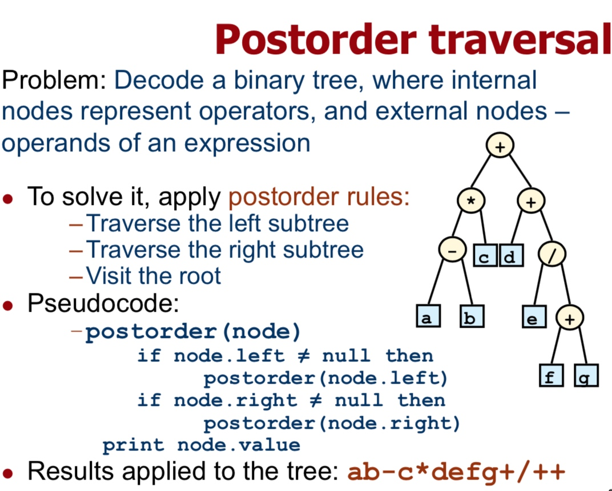

# Week 06
Path Lengths and Huffman’s Algorithm

路径长度及霍夫曼算法

建议参考 情报理论 后半内容。

## 概念

### Error checking
错误检出 

parity algorithms 检测算法
简单来说就是加个parity data(检测位)

简单的实现：
$x_1⊕x_2⊕x_3 = 检测位$

### Error correction
错误订正

简单的实现：

传送前
1 = 111
0 = 000
传送后
(1的个数 >= 2) => 1
(0的个数 >= 2) => 0

### Data compression
数据压缩

数据压缩可以让数据传输更加快。

两边都得有以下2个功能
encoding(解码) <=> compression(压缩)

### Data encryption 
数据加密

没啥好说的，就是安全了点。

### Data encoding
数据解码

比如 RGB，ASCII 码一样，都是有一定规则排列后，用特殊方式去读取。

### Binary trees: Complete and extended
#### **extended binary tree**
对于所有节点，要么有2个子节点，要么1个子节点都没。

#### **complete binary tree**
各层节点 filled (全满)，除了最后一层。
最后一层节点全部靠左。

### Encoding with binary trees
二叉树解码

编码方式：
0 左 1 右

Path Length 路径长度：
经过的边数，如「000」长度为 3，「01」长度为 2。

例子：外部（最下面）节点是8进制下的数字

### Huffman Coding
霍夫曼编码

步骤：

1. 获取样本数据
2. 对各个 symbol(字符，标志) 进行 count(计数)
3. 按次序排好位，每个位子当作一个 node(节点)来看。
4. 从使用次数最少的 symbol 开始，寻找最小的两个节点连接，生成新的节点
5. 继续寻找，循环生成完整子树

## 各种遍历法
引用台湾的一个笔记：
> **Preorder Traversal** 前序遍歷
理論上的遍歷順序是：根、左子樹、右子樹。根排在前面。
即是 Depth-first Search。

> **Inorder Traversal** 中序遍歷
理論上的遍歷順序是：左子樹、根、右子樹。根排在中間。
實際上是採用 Depth-first Search，只不過更動了節點的輸出順序。

> **Postorder Traversal** 後序遍歷
理論上的遍歷順序是：左子樹、右子樹、根。根排在後面。
實際上是採用 Depth-first Search，只不過更動了節點的輸出順序。

