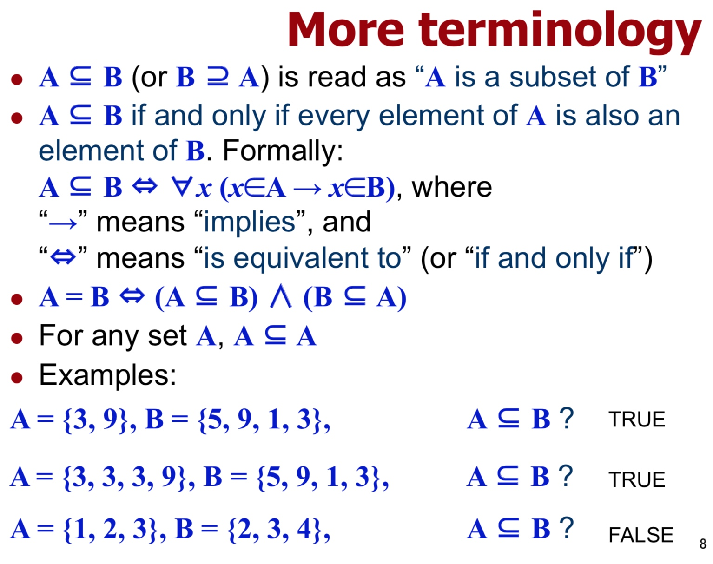
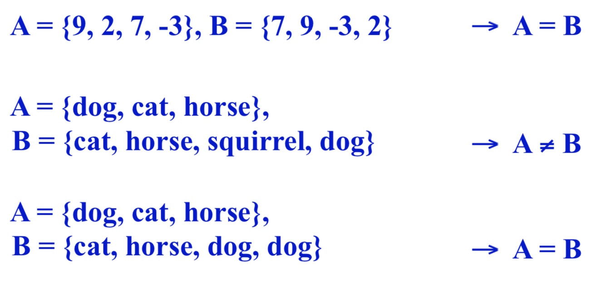
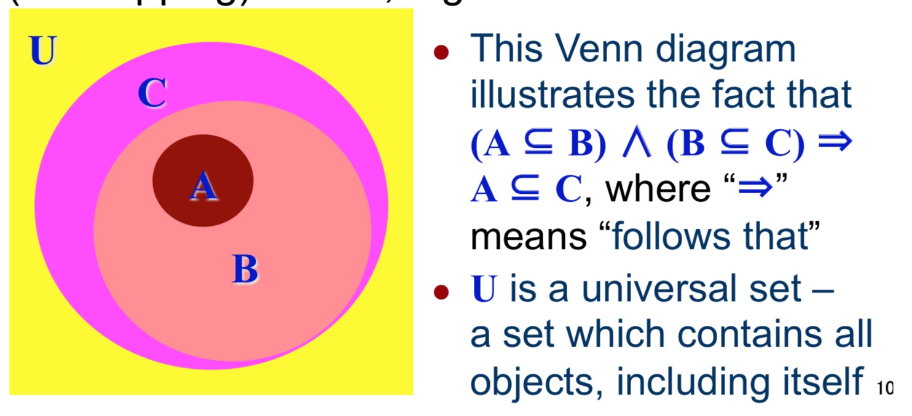
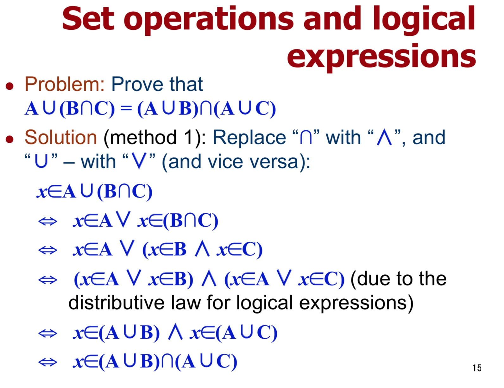
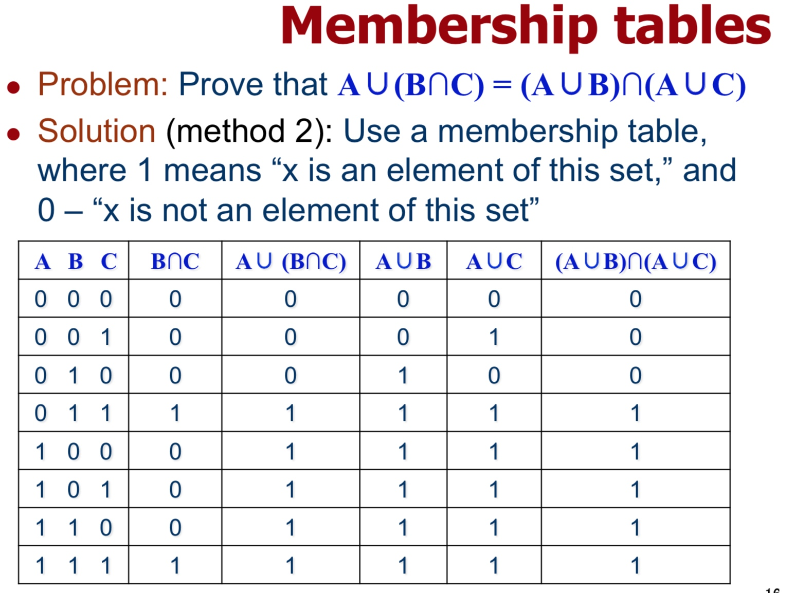
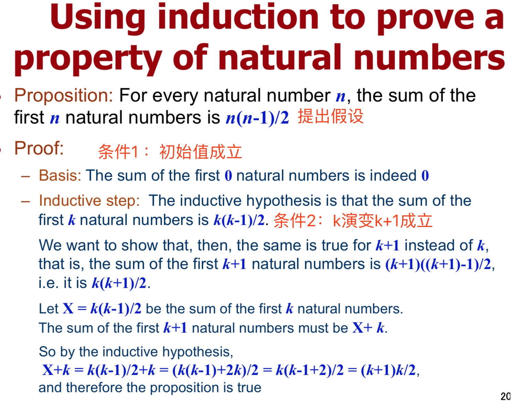

# Week 08
集合理论

## 基本概念
**Cardinality of a set**
the number of elements in a set

可表示为 |A| 或 n(A) 或 #(A) 或 card(A)

**运算**
$A – B = A \backslash B = \{x | x \in A ∧ x \not\in B\}$
$A^{c} = U – A$

**从属关系**

- a∈A: “a is an element of set A,” or “a is a member of set A”
- a∉A: “a is not an element of set A”
- A= {a1, a2, ..., an}: “set A consists of n elements: a1,...”

A ⊂ B 的意思：A 是 B 的部分集合，取不了等号。

**集合相等**

去除相同的 elements（元素）后，集合内的元素完全相同。（顺序不论）

**常见集合（数学中很常见）**
𝑵  自然数（0以上的整数）
𝒁  整数
𝒁+ 正整数
𝑹  实数
𝑸  有理数
∅  空集（是全部集合的子集）

**Power Set**
**常考点**
中：幂集
C(A) = n
C(Power(A)) = $2^n$

## Venn Diagrams
文氏图

用圈表示集合

## 集合操作及逻辑表现

## 成员表

## The principle of (mathematical) induction
数学归纳法的原理

Induction works by
归纳法可实现在以下条件
1) proving the statement is true for a starting value,
1) 证明初始值满足假想（通常是公式）
2) proving that the process used to go from one value to the next is valid.
1) 证明某一个数演变到下一个数的时候假想成立（通常是公式）
If (1) and (2) are both proven, then any value can be obtained by repeating the process
如果两个条件都被证明了，那么其他值也就可以按照这个操作方式重复演算得出

例子：

