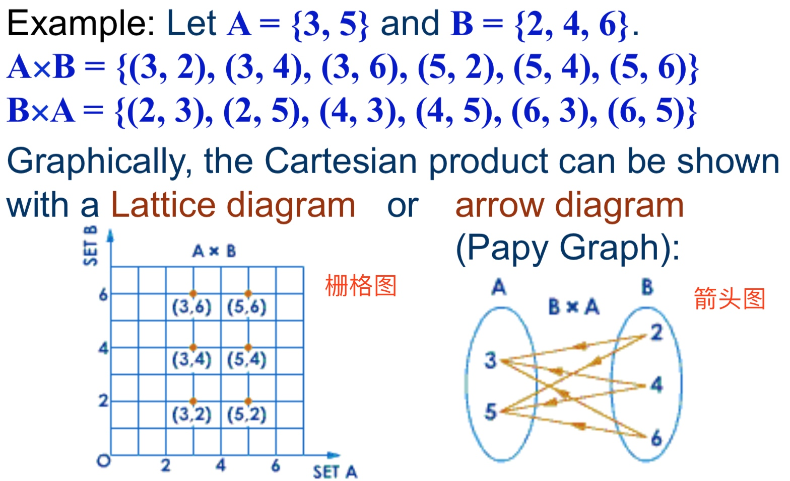
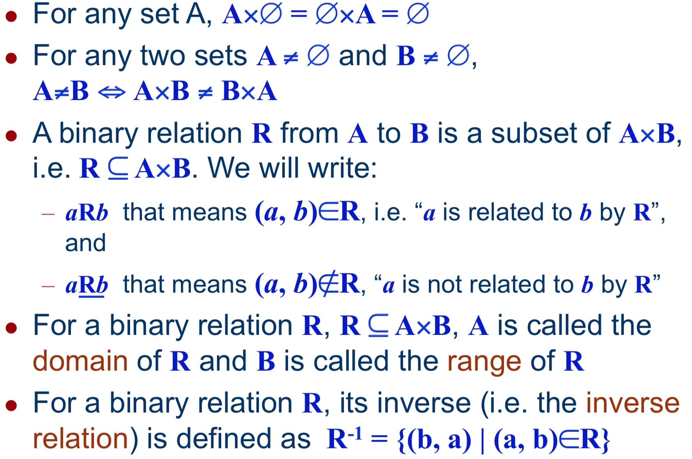
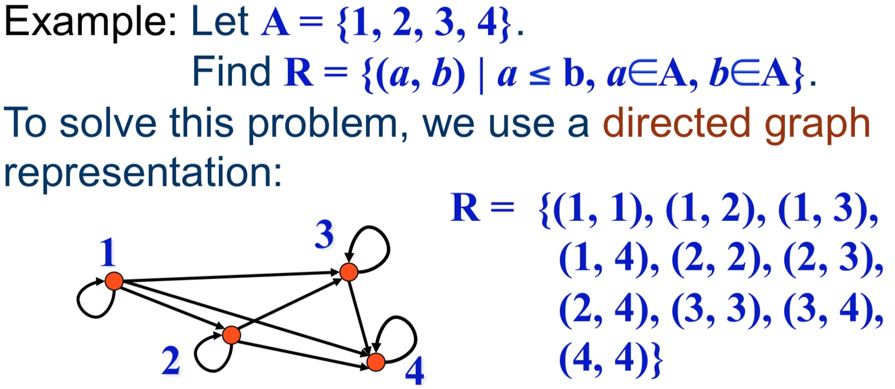
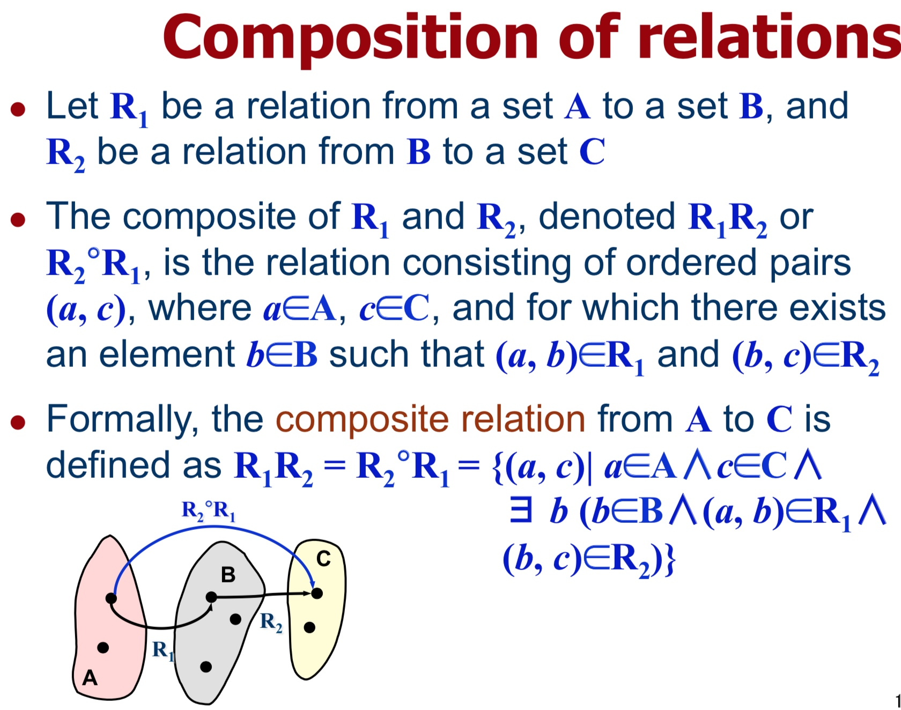
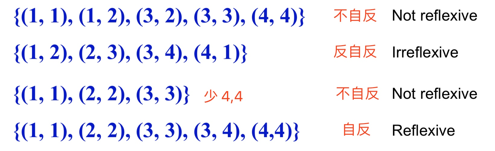
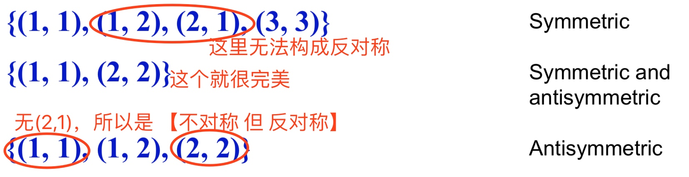
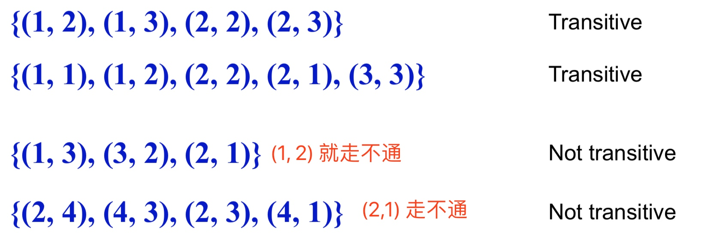

# Week 09
a set-theoretic introduction to Relations and their Properties
集合理论中的关系和属性

## tuple
元组 [维基百科](https://zh.wikipedia.org/wiki/多元组)

n元元组例子：
Two ordered n-tuples, (a1, a2, a3, ..., an) and (b1, b2, b3, ..., bn) are equal if and only if they contain exactly the same elements in the same order.
->  ai =bi for all 1 ≤ i ≤ n
也就是说两个元祖相同的条件相较于集合更加苛刻，需要每个序位上元素相等。

## Cartesian product
笛卡尔积

笛卡尔积是两个集合产生的一个**集合**

## 各种二元关系

-------

-------

## 易混淆的一个例子
For a set A, |A| = n, there are $n^2$ elements in A×A. As Power(A×A) = $2^{n^2}$ , there can be defined $2^{n^2}$ different relations on A.

对于已知的 A，C(A)(=|A|) = n
笛卡尔积运算 C(A×A) = $n^2$
Power Set的性质: C(Power) 变为$2^{OldC}$ （忘记的话详见 Week 08 笔记）
所以 Power(A×A) = $2^{n^2}$ 
 

## Reflexive relations
自反关系

设 A = {1, 2, 3, 4}
设存在一个关系 R。

如果 R 中**包含了全部**的(x, x) $x\in A$
Reflexive 自反成立。
如果 R 中**不包含任意一个**(x, x) $x\in A$
irreflexive 反自反成立

## Symmetric relations
对称关系

设 A = {1, 2, 3}
设存在一个关系 R。

R 中如果存在 (x, y)，那么(y, x)也存在。$x, y\in A$
Symmetric 对称成立

R 中如果已经存在 (x, y) 及 (y, x)，那么能得到 x=y 的结果的话。$x, y\in A$
antisymmetric 反对称成立

**难点**是在于反对称，反对称只讨论 R 中已经存在的 (x, y) 及 (y, x)，无法组成这个セット的话，就没有讨论的必要。一旦在 R 中的所有 (x, y) 及 (y, x) 两两配对的セット讨论完，均有 x=y 的关系的话，就可以认为其为反对称。
简单判断方式：是不是对称无所谓，就对称项来说，仅存在(x,x)这样的对称项，无(1,2)(2,1)这种常规对称项。

👆上面两个关系可以同时存在，也可以只存在一个。

## Transitive relations
传递关系

设 A = {1, 2, 3}
设存在一个关系 R。

对于 R 中所有(x, y),(y, z) 都可以推出 (x, z) 的话
Transitive 传递成立

## Equivalence relations
等价关系

词根记忆
Equi：相等
valence：价值

构成条件：Reflexive 且 Symmetric 且 Transitive

## Partial ordering relations
偏序关系

构成条件：Reflexive 且 **Antisymmetric** 且 Transitive

