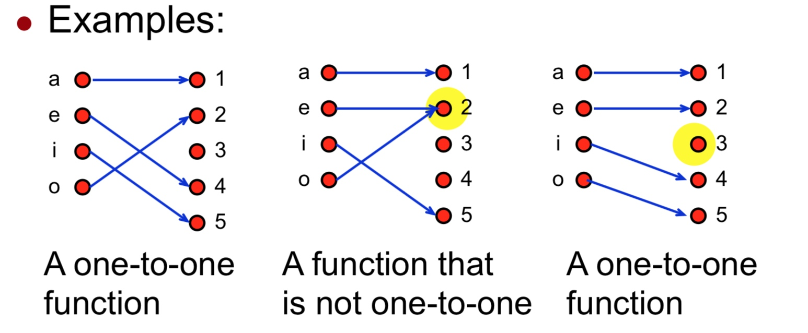
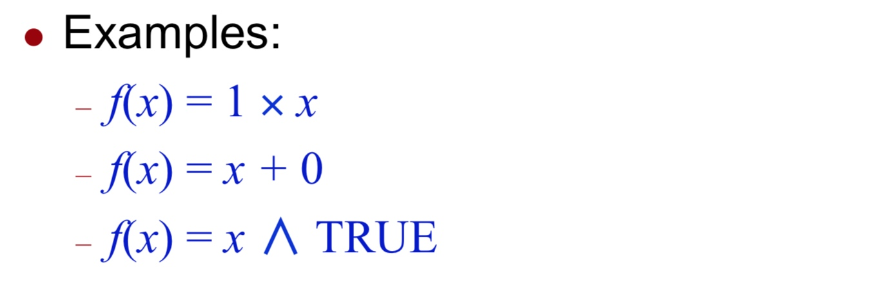
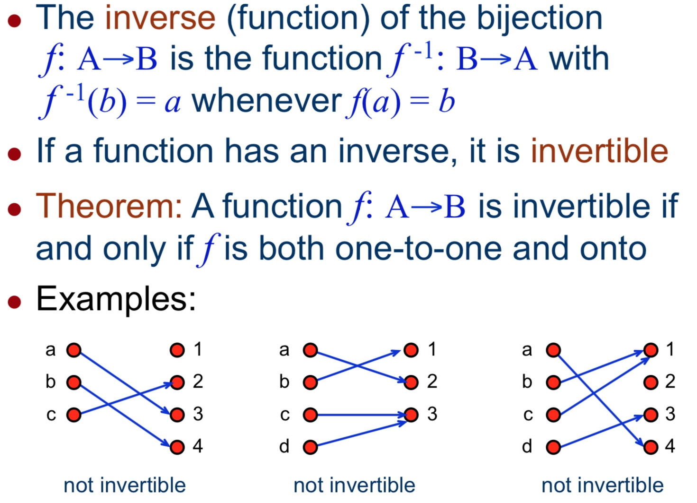
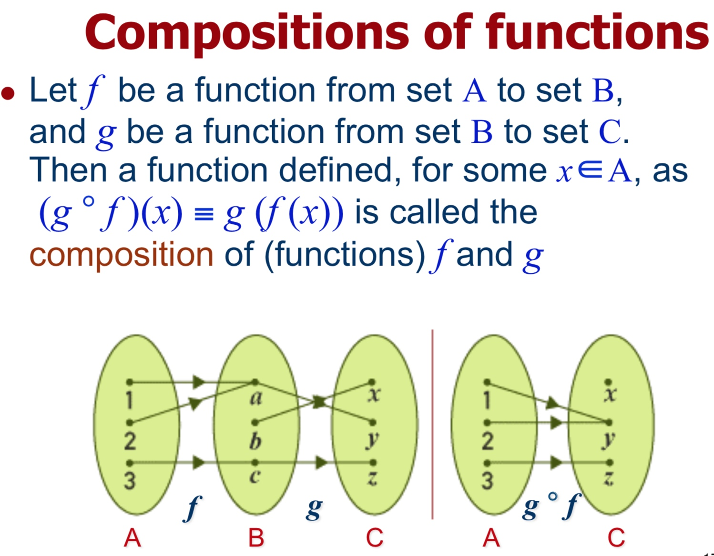

# Week 10
The Concept of Functions
函数概念

本周内容请一定要在非常熟悉第九周内容的基础上进行复习。
## 基础概念
### function 函数

假设从 A 映射到 B，写做：f: A→B
每个 A 中的数据 a 经过 f(a) 都可以映射到**唯一的**位于 B 中的数据 b

这个例子之中：
f maps A to B
A 是 Domain 定义域
B 是 Co-domain 上域
a 是 b 的 Pre-image 前像
b 是 a 的 Image 像

### 1-to-1 functions
单射

别名：injection，injective function

判断前提：**是个函数**
判断方式：f: A → B 中，B 中的数据有存在至多一个 pre-image(前像)。

### Onto functions
满射

别名：surjection，surjective function

判断前提：**是个函数**
判断方式：f: A → B 中，B 中的每个数据都有一个或多个 pre-image(前像)。

### Bijections
双射
别名：one-to-one correspondence, bijective function

既是单射又是满射的话 => 双射

## Identity functions
恒等函数 = 一无任何作用的函数

## Inverse functions
反函数

## 多函数

## 常见考点
一次函数：A 1-to-1 and onto function
二次函数：A not 1-to-1 and not onto function

其他可以通过写出定义域，值域来判断。

