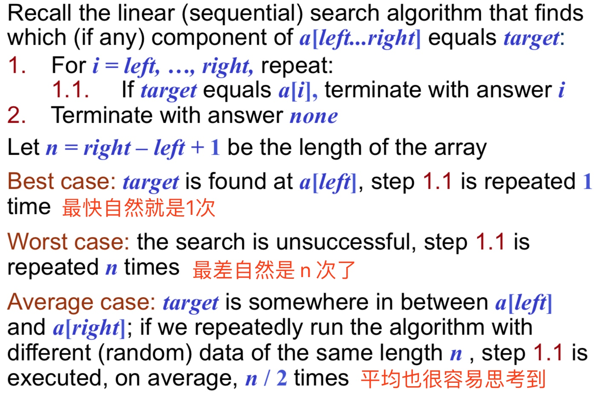
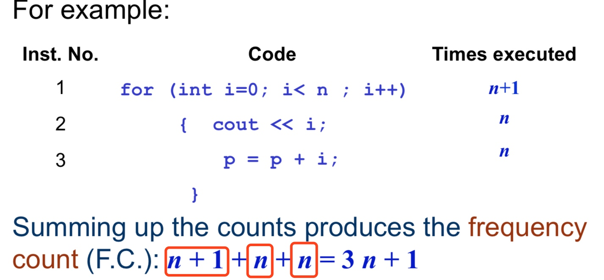
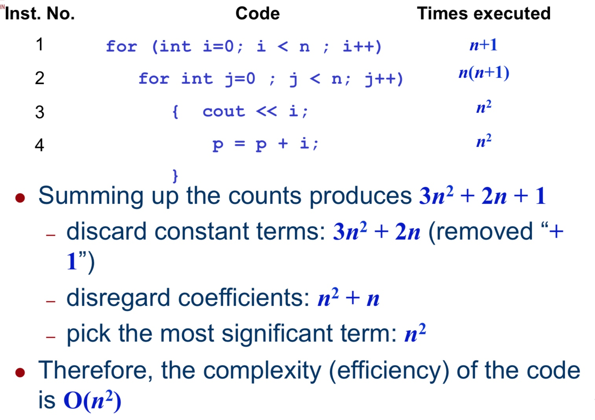
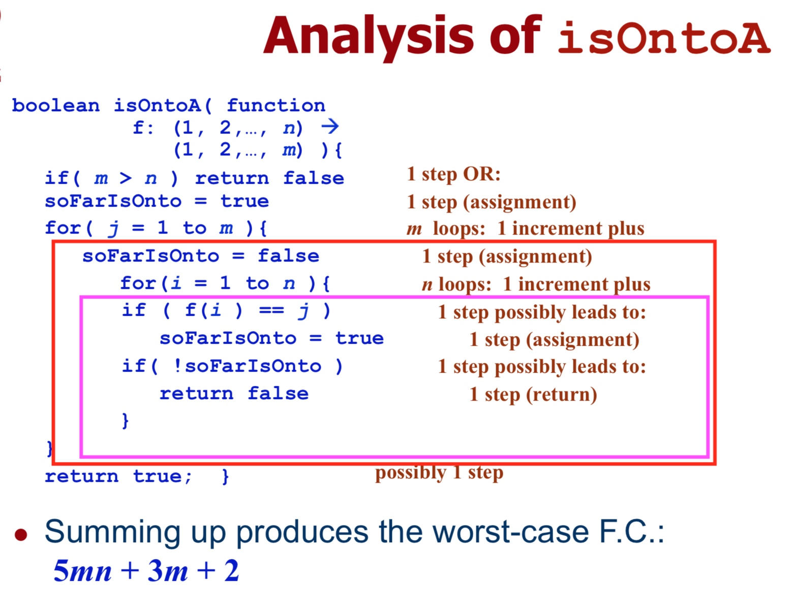
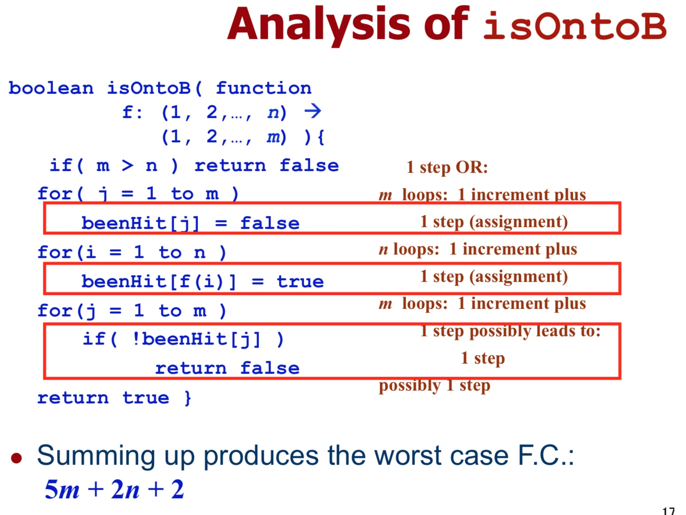
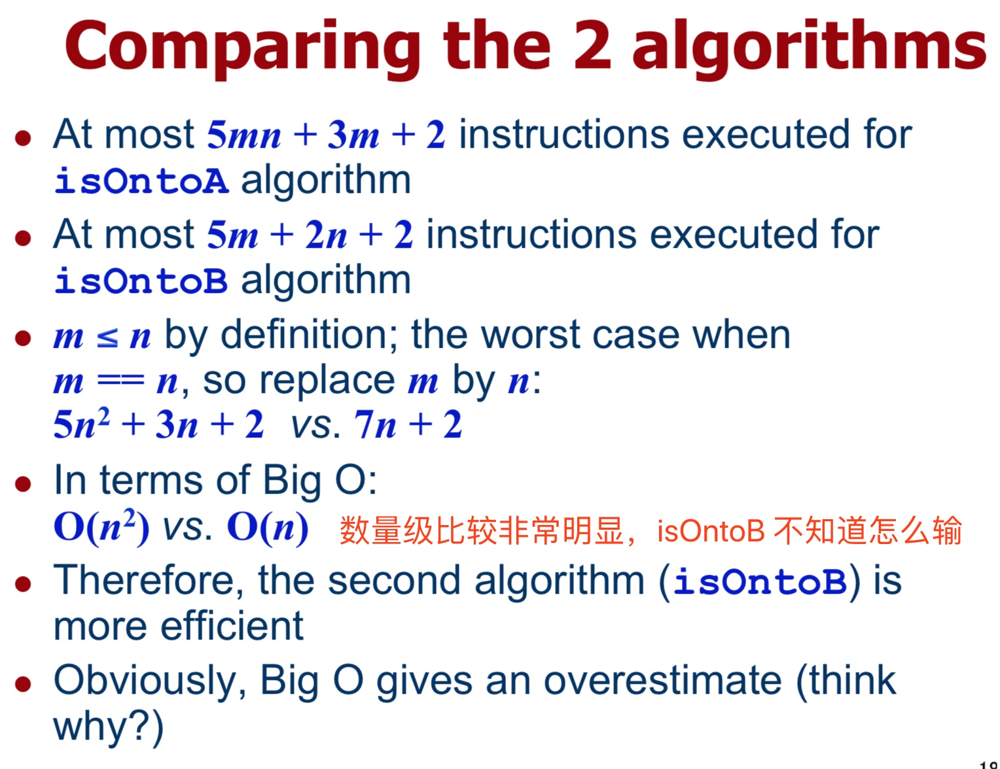

# Week 11
Algorithm Analysis (Big O)
算法分析（大 O）

## Algorithm efficiency
算法效率

算法效率是用来衡量解决问题所消耗资源的多少的。
虽然近年以来硬件的发展日新月异，为我们提供了大量的计算基础。
但在便捷终端设备，可穿戴设备上依旧存在问题，需要通过算法优化。

~~翻译完才发现这段话没什么卵用。~~

## Big O
大 O 符号

以下摘自维基百科
> 大O符号（英语：Big O notation）是用于描述函数渐近行为的数学符号。更确切地说，它是用另一个（通常更简单的）函数来描述一个函数数量级的渐近上界。在计算机科学中，它在分析算法复杂性的方面非常有用。

order of magnitude(数量级)是 Big O 考察的目标。

简而言之，就是把 $2n^2+n$ 这种简化，当$n^2$处理。令人窒息的偷懒方法。🙃

而且，也并不是无敌的，比如$1000x^{5.9}$和 $x^6$ 在很多时候还是前者占优。
所以有时候要用概率论来分析，不过这是后话了。

## Program design and algorithm complexity
程序设计与算法复杂度

Best case 最佳场景
Average case 平均场景
Worst case 最差场景

从软件设计出发，只有最差场景有用。
原因：先苦后甜，最差的既是痛点也是提升点

## 例子1 线性搜索


## 指令是什么
在深入探讨之前，还是先搞清楚什么是指令，什么不是

讲义中稍微罗列了一下，粗粗了解即可。

- Assignment （地址，内存）分配
- Increment (decrement) （数据）增减
- Comparison 比较
- Negation 否定
- Return (function, etc.) 返回
- (Random) array access (随机)数组存取
- Function (method, etc.) output access 函数（方法等）输出存取

## Frequency count
频率计数

for 文中存在比较赋值等操作，故估算时间为 n+1。
循环内各运行了 n 次。



## 稍微复杂一点
在外面多加一层循环的情况下，观察复杂度，这次要导出 Big O。



## 复杂实例分析两个算法
首先重新讲一下 Onto 的概念：
f: A → B 中，B 中的每个数据都有一个或多个 pre-image(前像)。

算法 A：

```
// 函数参数为一个函数映射，
boolean isOntoA( function
f: (1, 2,..., n)→(1, 2,..., m) ){
  // 如果 Co-domain 中的数字比 Domain 大，必然不为 onto
  if( m > n ) return false // cannot be onto
  
  // 用布尔变量记录「到目前为止是否为 onto」
  soFarIsOnto = true

  // 循环 Co-domain 中的全部元素
  for( j = 1 to m ){
  	 // 初始化为假
     soFarIsOnto = false
     // 循环查找是否在 Domain 中存在 pre-image
     // 找到的话标记为 true
     for(i = 1 to n ){
          if ( f(i) == j )
               soFarIsOnto = true
     // 循环结束还没找到，就说明至少有一个 Co-domain 中的元素不符合条件
     // 返回假，退出函数
     if( !soFarIsOnto ) return false;
} }
  // 全部 Co-domain 中的元素都找到了 pre-image
  // 返回真，退出函数
  return true; }
```

算法 B：

```
// 函数参数为一个函数映射
boolean isOntoB( function
f: (1, 2,..., n)→(1, 2,..., m) ){
	// 如果 Co-domain 中的数字比 Domain 大，必然不为 onto
	if( m > n ) return false

	// 初始化一个数组用来记录 Co-domain 中元素是否有 pre-image
	// 默认为 false
	for( j = 1 to m )
	    beenHit[j] = false;

	// 循环 domain 内的元素，将其映射的那个 image 设定为 true
	for( i = 1 to n )
	    beenHit[f(i)] = true;

	// 找找看是否存在标记仍为 false 的元素
	// 找到了说明有元素没有 pre-image
	for( j = 1 to m )
	    if( !beenHit[j] )
	    	return false;

	// 找不到说明都被映射到了
	return true;
}
```

看懂源码的基础上，再看算法复杂度分析








## 常见复杂度
📣易考

O($1$), `constant time`
constant 常数
常见操作：Stack Push and Pop operations

O($n$), `linear time`
linear 线性
常见操作：Traversal of an array with n elements

O($n^2$), `quadratic time`
quadratic 二次方的
常见操作：Simple sorting algorithms (e.g. ⭐️Selection sort⭐️)

O($logn$), `logarithmic time`
logarithmic 对数的
常见操作：⭐️Binary search⭐️ in a sorted list of n elements

O($nlogn$),`n log n time`
常见操作：Advanced sorting algorithms (e.g. ⭐️MergeSort⭐️)

O($a^n$), exponential time
exponential 指数的

常见操作：Permutations of n objects（常考 Power Set 的生成）


