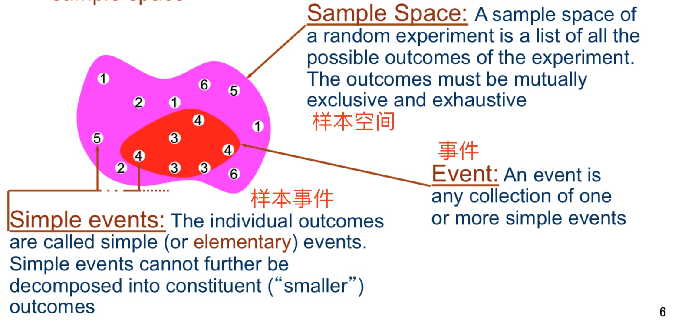
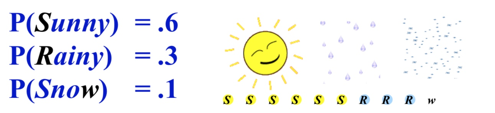
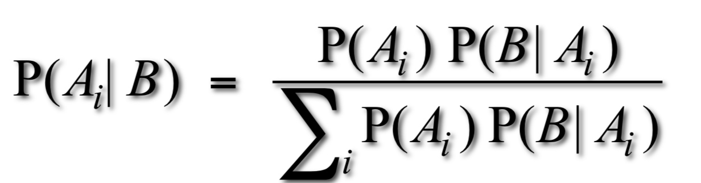
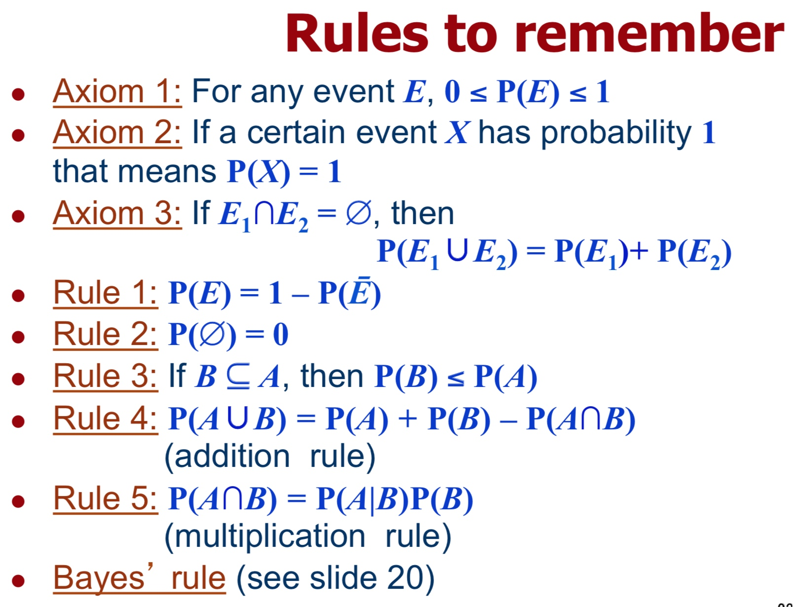

# Week 12
Probability Theory:  An Overview
概率论，Ruck 的拿手好戏

## Random
计算机里的随机不是随机的，还是一种重复运算得出的值。不存在真正的随机，但是经过伪随机数能够产生用于科学计算，过程模拟的可用随机数据。

具体参考『確率統計』课程讲义。

## 概率论基础概念

大 P 表示概率，P 是 Probability概率 的缩写。

比如：

P(降水) = P(Rainy) + P(Snow) = 0.4

1. P($A \vee  B$) = P(A 发生 或是 B 发生或是 AB 一起发生)
2. P($A \wedge B$) = P(A B同时发生)
3. P($\bar A$) = P(NOT(A)) = P(A 不发生) 
4. P($A|B$) = P(已知 B 发生之后的 A 发生概率)
    
## 基础公式
\\[P(C|B) = \frac{P(C\wedge B)}{P(B)}\\]

Bayes' theorem
贝叶斯定理 ベイズの定理

## 没了
这节课比起看这个，还不如把 情报理论 的例题看几遍

