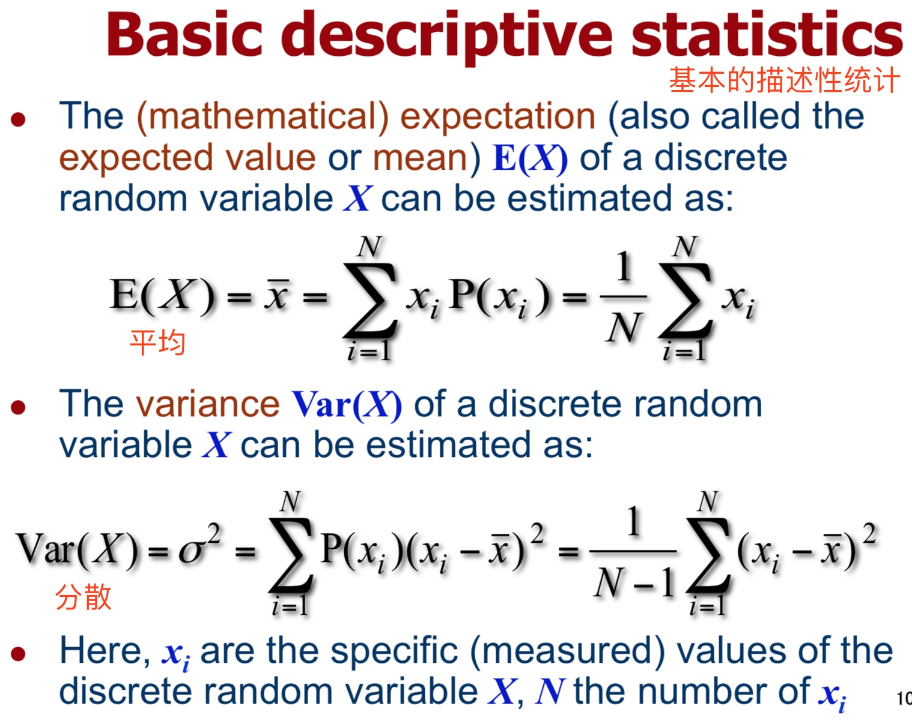
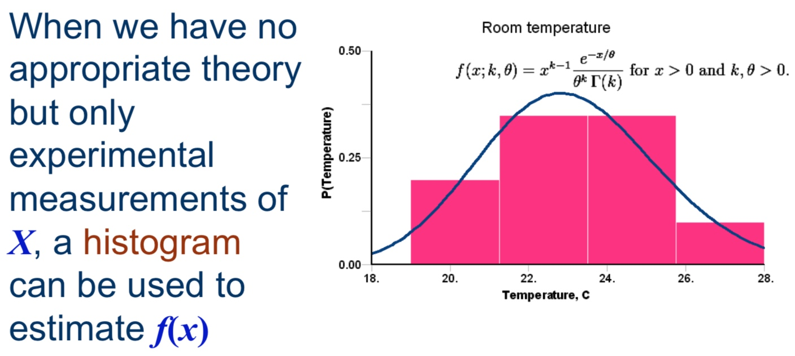

# Week 13
Random Numbers and Monte Carlo Method
随机数与蒙特卡罗方法

这节课建议找出　確率統計 的讲义结合复习。

## 随机数
### 什么是随机数
A random variable is the outcome of a random experiment represented in a numerical form
一个随机数是一次数字形式的随机试验的结果。

A random variable is discrete if the number of the experiment’s possible outcomes is finite or countable
如果嗦随机试验所有的可能总数是有限的或是可数的，那么就说这个随机数是 discrete（分离的）。

-------
所以就有两类了：
Pseudorandom numbers (PRN)= 可预测的算法产生的数字
比如下面这个算法👇

```
int RND() {
    seed = seed*A+B;
    return (unsigned int)(seed/(N*2))%N;
}
```
这些算法的特性有：

1. 本身遵从正态分布
2. 无法准确预测某一时刻的特定输出值
3. 不会困死在某一小段循环之中
4. 数据可以用相同的 seed 重现

-------

True random numbers (TRN)= 真・随机数
产生方式依据一些稀奇古怪的不知道的东西。
比如：

- 放射性物质的衰变时间
- 半导体、电阻的噪音
- 电台的噪音

然后通过一些手段转换成数字。

这个部分考试应该没法考，但还是有了解的必要

## 一些公式



Expectation：平均
variance：分散

### Probability density function
简称 PDF

Wikipedia 摘抄：
> 在数学中，连续型随机变量的概率密度函数（在不至于混淆时可以简称为密度函数）是一个描述这个随机变量的输出值，在某个确定的取值点附近的可能性的函数。而随机变量的取值落在某个区域之内的概率则为概率密度函数在这个区域上的积分。当概率密度函数存在的时候，累积分布函数是概率密度函数的积分。概率密度函数一般以大写“PDF”（Probability Density Function）标记。

\\[P(a < X ≦ b) = \int_{a}^{b}f(x)dx\\]



如果我们没啥办法精确计算，但是可以通过多次实验来画出 **histogram** 来估计 $f(x)$。

## Monte Carlo Method
蒙特卡罗方法

Wikipediaより

> 20世纪40年代，在冯·诺伊曼，斯塔尼斯拉夫·乌拉姆和尼古拉斯·梅特罗波利斯在洛斯阿拉莫斯国家实验室为核武器计划工作时，发明了蒙特卡罗方法。**因为乌拉姆的叔叔经常在摩纳哥的蒙特卡洛赌场输钱得名👍**，而蒙特卡罗方法正是以概率为基础的方法。

实例：可以用点的个数来估算面积从而推算圆周率。
撒了 n 个豆子，m 个位于扇形内的话，就认为是
\\[S_{扇形} = S_{正方形} \times\frac{m}{n}\\]


这个方法的优点是：

1. 操作简单，非常快能进行 simulation(模拟)
2. 比起理论分析，能照顾到更多底层细节

缺点：
1. 准确度还是低了点
2. 当模拟事件产生几率不等时，很难找到模拟"正确的"理论上的PDF。

