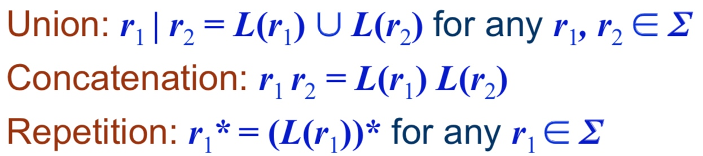

# Week 14
Finite State Automata and  Turing Machines
有限状态机及图灵机

下发的正则表达式将义建议熟读。
熟悉编译原理的话可以跳过。

## Computation
计算

1. Computation is a mapping of a binary input to a binary output.
2. (Abstract) computational devices are simplified models of real computations. 
3. Finite (state) automata are devices used to model (analyze and compare)  small  (but not necessarily simple) computers. Turing machines are to model any computers
4. Regular languages, expressions, and grammars provide mathematics for finite automation

-------

1. 计算是一种从二进制输入到二进制输出的映射关系。
2. (抽象的)计算型设备都是真实计算的简化模型。
3. 有限状态机是用于建模（计算&比较）小型（不一定是简单的）计算机的。图灵机是所有计算机的模型。
4. 正则语言，正则表达式以及正则语法为有限状态提供了数学支持。

## Finite state automaton
有限状态机，简称 FSA

我们可以用下面这种 state diagram(状态图) 来表示

Σ 用来表示 symbol(符号) 的集合。
L(Σ) 用来表示集合Σ上的语言，是 string 的集合。

The set of all possible strings, including the empty string denoted ε, is written as Σ*
空 string 记作 ε，
如果一个集合中包含了全部可能的语言，那么记作 Σ*。

正规的定义

## Regular expressions
正则表达式，常见缩写 Regex(日式英语缩写风)

解析之 0\*(0|1)
0\* 表示了 n 个 0
(0|1) 表示了 可能是 1 也可能是 0
=> L = {0, 1, 00, 01, 000, 001, 0000, 0001, ...}

## Formal grammars
形式语法

## 正则语法
就是上面讲到的 P 中的元素。
常见如：A → aB 这种
意思就是 A 等价于 aB

## 结合讨论
一定要看懂下面2个例子，没看懂就再看看上面。

## Turing Machine
图灵机

A Turing machine can do the following:
一个图灵机可以做以下事情：

- Write a character to the current tape cell
- 在当前带孔写入字符
- Move the Read/Write Head one cell to the left or right
- 使 读取头/写入头 向左边或是向右边移动一个格子
- Go into a new state
- 进入新的状态

Its behavior is defined by the rules and depends only on the input (i.e. the character in the current
tape cell) and the current state.
它的行为仅依据输入数据定义的规则及当前状态。
输入数据一般在带孔上。（以前程序都放在一个长卷带上，通过打孔表示数据）

